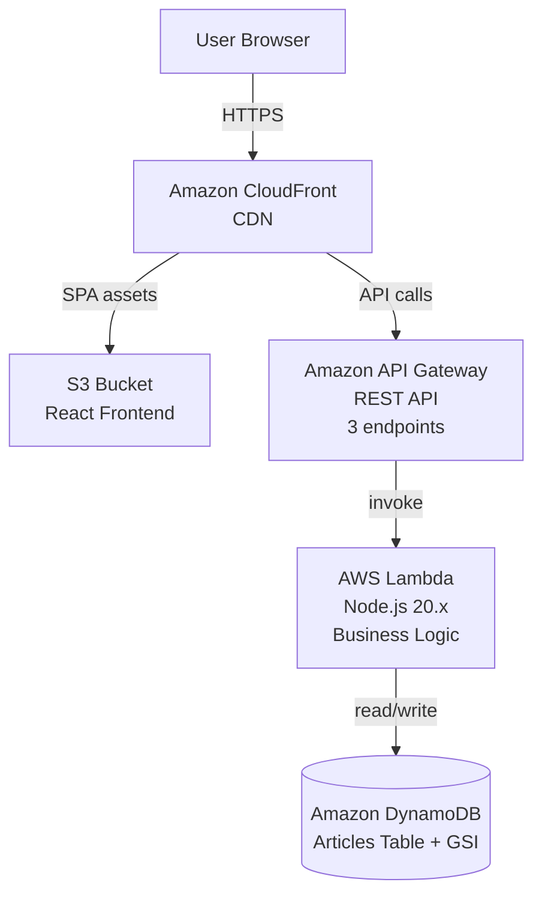

# Frecuencia Colectiva - Digital News Platform

[](https://react.dev/)
[](https://www.typescriptlang.org/)
[](https://aws.amazon.com/)
[]()
[](LICENSE)

A modern digital news platform for cultural coverage in Toluca, Estado de Mexico. Built with React and AWS CDK, based on Frecuencia Colectiva's journalism model.

## About Frecuencia Colectiva

**Frecuencia Colectiva** is a local digital media outlet focused on cultural coverage in Toluca Centro. Through testimonial-based journalism, interviews, and research, it aims to make visible cultural expressions and issues that impact public life in the region.

**Mission**: Inform and connect culture with public life in Toluca Centro.

**Approach**: Preventive and constructive journalism that prioritizes the social value of information. Coverage excludes sensationalism and crime news ("nota roja") to maintain cultural identity coherence.

## Coverage Areas

- Cultural activities in Toluca Centro
- Public spaces and cultural venues
- Local social and cultural actors
- Urban issues and dynamics
- Citizen initiatives and cultural projects
- Daily life in the city center

## Content Types

### Themes
- **Expresiones artísticas** - Artistic expressions
- **Costumbres, creencias y tradiciones** - Customs, beliefs and traditions
- **Modos de vida** - Ways of life

### Sections
- **Arte visual** - Visual arts
- **Arte escénico** - Performing arts
- **Cine y audiovisual** - Film and audiovisual
- **Festividades locales** - Local festivities
- **Historias familiares o comunitarias** - Family or community stories
- **Gastronomía** - Gastronomy
- **Patrimonio** - Heritage
- **Identidad** - Identity
- **Agenda cultural digital** - Digital cultural agenda

## Technology Stack

### Frontend
- **React** 18.2.0
- **TypeScript** 5.3.0
- **Vite** 5.1.0 (build tool)
- **React Router** 6.22.0
- **Tailwind CSS** 3.4.0
- **Vitest** 1.3.0 (testing)
- **ESLint** 8.57.0

### Backend
- **AWS CDK** (Python v2)
- **AWS Lambda** (Node.js 20.x runtime)
- **Amazon DynamoDB** (database)
- **Amazon API Gateway** (REST API)
- **Amazon CloudFront** (CDN)
- **TypeScript** 5.3.0
- **Jest** 29.7.0 (testing)

## Project Architecture



### Components
- **Frontend**: React SPA deployed to S3, served via CloudFront
- **API Layer**: REST API with 3 endpoints (/articles, /articles/{id})
- **Compute**: AWS Lambda functions for business logic
- **Storage**: DynamoDB table with GSI for category filtering

## Getting Started

### Prerequisites
- Node.js 20.x
- Python 3.10+
- AWS CLI configured
- npm or yarn

### Installation

```bash
# Clone the repository
git clone <repository-url>
cd frecuencia-colectiva

# Install frontend dependencies
cd frontend
npm install

# Install backend dependencies
cd ../backend
npm install
pip install -r requirements.txt
```

### Environment Variables

Create a `.env` file in `backend/`:
```bash
AWS_ACCOUNT=your-aws-account-id
AWS_REGION=us-east-1
```

Create a `.env` file in `frontend/`:
```bash
VITE_API_BASE_URL=https://your-api-gateway-url.amazonaws.com/prod
```

### Development

```bash
# Frontend (terminal 1)
cd frontend
npm run dev

# Backend (terminal 2)
cd backend
npm run build
npm run test
```

### Deployment

```bash
# Deploy backend
cd backend
npm run build
npm run deploy

# Deploy frontend (after building)
cd ../frontend
npm run build
# Upload dist/ contents to S3 bucket
```

## Project Structure

```
frecuencia-colectiva/
├── frontend/                 # React frontend
│   ├── src/
│   │   ├── components/       # UI components
│   │   │   ├── Navbar.tsx
│   │   │   ├── HeroArticle.tsx
│   │   │   ├── ArticleCard.tsx
│   │   │   ├── ArticleDetail.tsx
│   │   │   ├── Footer.tsx
│   │   │   └── RelatedArticles.tsx
│   │   ├── pages/            # Page components
│   │   │   ├── HomePage.tsx
│   │   │   ├── SectionPage.tsx
│   │   │   └── ArticlePage.tsx
│   │   ├── hooks/            # Custom React hooks
│   │   ├── types/            # TypeScript definitions
│   │   ├── utils/            # Utility functions
│   │   └── test/             # Unit tests
│   └── package.json
│
├── backend/                  # AWS CDK infrastructure
│   ├── src/
│   │   ├── handlers/        # Lambda handlers
│   │   │   ├── listArticlesHandler.ts
│   │   │   ├── getArticleHandler.ts
│   │   │   └── filterByCategoryHandler.ts
│   │   └── infrastructure/   # CDK stack
│   │       └── news_stack.py
│   ├── test/                 # Unit tests
│   ├── requirements.txt      # Python dependencies
│   └── package.json
│
├── scripts/                  # Utility scripts
├── LICENSE
└── README.md
```

## Key Features

- **Cultural Coverage**: Local cultural news and events in Toluca
- **Category Filtering**: Filter by culture, arts, events, gastronomy
- **Storytelling**: Narrative-focused content
- **Responsive Design**: Mobile-first with editorial layout
- **CDN Delivery**: Fast content delivery via CloudFront
- **Serverless Backend**: Cost-effective Lambda functions

## Design

Frecuencia Colectiva follows an editorial visual identity inspired by newspaper design.

- **Colors**: `#c50907` as the brand red, `#ffffff` as the background, and `#000000` for text.
- **Typography**: Merriweather for headlines and a clean sans-serif for body text.
- **Layout**: Responsive editorial grid with a newspaper-style structure and clear content hierarchy.
- **Accent usage**: Red is used selectively for highlights, links, section labels, and calls to action.

## Editorial Policy

- **NOT covered**: Crime news ("nota roja") - breaks cultural theme
- **Approach**: Constructive journalism, avoiding sensationalism
- **Legal**: Respect for copyright law, credits to photographers and artists
- **AI Use**: Assisted content must be supervised by humans
- **Transparency**: Editorial independence from advertisers

## Target Audience

- Young people (18-25) interested in local culture
- Emerging artists
- Cultural event organizers
- Adults interested in local cultural consumption

## Development Workflow

### Branching Strategy
- `main` - Production branch
- `develop` - Development branch
- Feature branches from `develop`

### Coding Standards

- **TypeScript**: Strict mode enabled
- **ESLint**: Pre-configured with React hooks rules
- **Testing**: Vitest for frontend, Jest for backend
- **Commit Messages**: Conventional commits

## Testing

```bash
# Frontend tests
cd frontend
npm test

# Backend tests
cd ../backend
npm test
```

## Contributing

1. Fork the repository
2. Create a feature branch (`git checkout -b feature/my-feature`)
3. Commit your changes (`git commit -m 'Add my feature'`)
4. Push to the branch (`git push origin feature/my-feature`)
5. Open a Pull Request

Please ensure all tests pass before submitting PRs.

## License

MIT License - Copyright (c) 2026 CarlosDiazData

See [LICENSE](LICENSE) for details.